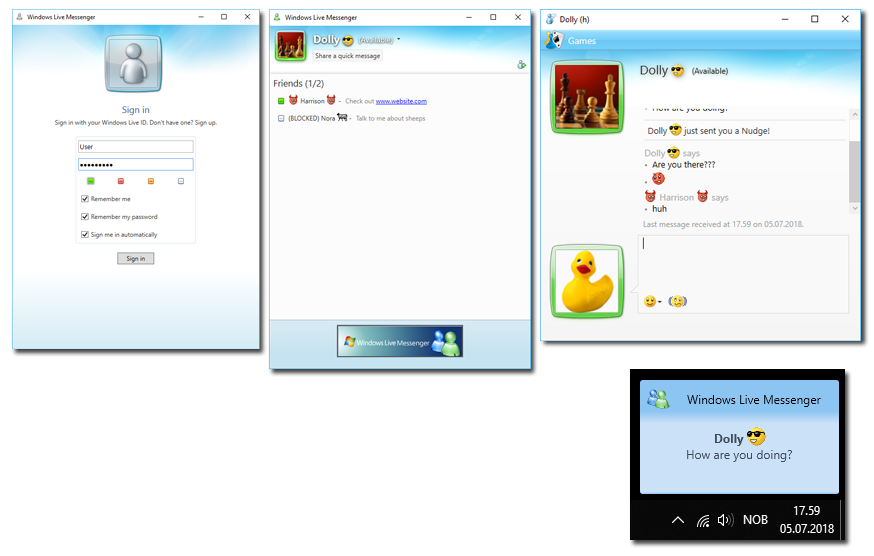

# Windows Live Messenger



## Features
+ Add / Remove / Block Contact
+ Send Nudge
+ Avatars
+ Quick Message
+ Emoticons
+ Web Registration
+ Encryption
+ Save ID & Password
+ Auto Login
+ Notification Bubble

## Compiling

### Prerequisite
* Microsoft Visual Studio 2012+
* [MySQL .Net Connector](https://dev.mysql.com/downloads/connector/net/6.10.html)
* [NetworkComms.Net](http://www.networkcomms.net/)

**To compile**: 

1. Open Windows Live Messenger.sln in Visual Studio

2. Add reference to MySQL and NetworkComms

3. Build Solution


## Installation

### Database Installation

Create a new MySQL database called msn.

Import msn.sql found in the Database folder.

### Server Installation

The server consists of the following files:

+ WLMServer.exe
+ WLMServer.exe.config
+ Messenger.config
+ WLMData.dll
+ MySql.Data.dll
+ NetworkCommsDotNetComplete.dll

After compiling open Messenger.config and insert the database information.

```xml
<appSettings>
  <add key="server_port" value="1323" />
  <add key="server_encryption_key" value="CHANGEME" />
  <add key="database_host" value="localhost" />
  <add key="database_id" value="root" />
  <add key="database_password" value="" />
  <add key="database_password_encryption_key" value="CHANGE_ME_123456_123456_" />
  <add key="database_password_encryption_iv" value="CHANGE_ME_123456" />
  <add key="avatars_enabled" value="false" />
  <add key="avatars_address" value="" />
  <add key="avatars_address_upload" value="" />
  <add key="broadcast_interval" value="30" />
</appSettings>
```

| Setting                             | Description                                                                                                                      |
| ----------------------------------- | -------------------------------------------------------------------------------------------------------------------------------- |
| server_port                         | *What port to use.*                                                                                                              |
| server_encryption_key               | *What encryption key to use for communicating with the client. Needs to be the same as the compiled value in the WLMClient.*     |
| database_host                       | *What database host to connect to for account information.*                                                                      |
| database_id                         | *What database user to use.*                                                                                                     |
| database_password                   | *What database user password to use.*                                                                                            |
| database_password_encryption_key    | *What encryption key to use for password encryption. Change the value but keep the length.*                                      |
| database_password_encryption_iv     | *What encryption iv to use for password encryption. Change the value but keep the length.*                                       |
| avatars_enabled                     | *Whether or not to use avatars (true/false). Relies on a webserver. See "registration page installation".*                       |
| avatars_address                     | *This is the address where avatars can be accessed from. For example http://localhost/uploads/*                                  |
| avatars_address_upload              | *This is the address to the upload page where the client can upload a new avatar. For example http://localhost/upload.php*       |
| broadcast_interval                  | *How often the server should update all the connected users contact lists. The value is in seconds.*                             |


### Registration Page Installation

Make sure /uploads has write permission (if you attend to use avatars).

Open config.php and insert the database information.

```php
<?php
$dbhost = 'localhost';
$dbuser = 'root';
$dbpass = '';
$dbname = 'msn';
$encryption_key = 'CHANGE_ME_123456_123456_';
$encryption_iv = 'CHANGE_ME_123456';
?> 
```

| Setting              | Description                                                                                                     |
| -------------------- | --------------------------------------------------------------------------------------------------------------- |
| dbhost               | *The database host address.*                                                                                    |
| dbuser               | *The database user with msn access.*                                                                            |
| dbpass               | *The database users password.*                                                                                  |
| dbname               | *The database name.*                                                                                            |
| encryption_key       | *The encryption key used to encrypt the registered passwords. This needs to be the same as the server uses.*    |
| encryption_iv        | *The encryption iv used to encrypt the registered passwords. This needs to be the same as the server uses.*     |


### Client Installation

The client consists of the following files:

+ WLMClient.exe
+ WLMClient.exe.config
+ Messenger.config
+ WLMData.dll
+ NetworkCommsDotNetComplete.dll

After compiling open Messenger.config and insert the server address and port number.

```xml
<appSettings>
  <add key="server_address" value="127.0.0.1" />
  <add key="server_port" value="1323" />
</appSettings>
```


| Setting              | Description                                  |
| -------------------- | -------------------------------------------- |
| server_address       | *The address the client should connect to.*  |
| server_port          | *The port the client should connect to.*     |